# Octocity Park System - Network Architecture Diagram

```mermaid
graph TB
    %% External Users
    User[👤 End Users] --> Internet[🌐 Internet]
    
    %% Public Zone
    subgraph "Public Zone"
        Frontend[🎨 Angular Frontend<br/>Nginx Server<br/>HTTPS]
        APIGateway[🚪 API Gateway<br/>WAF Protection<br/>Rate Limiting]
    end
    
    %% Application Zone
    subgraph "Application Zone (AWS EKS)"
        BackendAPI[⚙️ NestJS Backend API<br/>Business Logic]
        
        subgraph "Microservices"
            FirebaseService[🔥 Firebase Service<br/>Notifications]
            NotificationService[📢 Notification Service<br/>General Notifications]
            WhatsAppService[💬 WhatsApp Service<br/>Messaging]
        end
        
        subgraph "Lambda Functions"
            ScheduledTasks[⏰ Scheduled Tasks<br/>Cron Jobs]
            SQSEventHandlers[🔄 SQS Event Handlers<br/>Queue Processing]
        end
    end
    
    %% Data Zone
    subgraph "Data Zone"
        PostgreSQL[(🗄️ PostgreSQL RDS<br/>parking_management_v2<br/>SSL Enabled)]
        RedisLocal[(🔴 Local Redis<br/>App Caching)]
        RedisGlobal[(🔴 Global Redis<br/>Shared Caching)]
        S3Storage[(☁️ Amazon S3<br/>mawgif-test-bucket<br/>File Storage)]
    end
    
    %% Integration Zone
    subgraph "Integration Zone"
        subgraph "SQS Queues"
            SyncQueue[📋 sync-v1-v2.fifo<br/>V1/V2 Sync]
            FirebaseQueue[📋 firebase-notifications<br/>Firebase Queue]
            ThumbnailQueue[📋 thumbnails<br/>Image Processing]
            TM1Queue[📋 tm1.fifo<br/>TM1 Integration]
            GovQueue[📋 government-platform.fifo<br/>Gov Platform]
            InvoiceQueue[📋 invoice-retry.fifo<br/>Invoice Retry]
            NotificationQueue[📋 notification.fifo<br/>General Notifications]
        end
    end
    
    %% External Services
    subgraph "External Integrations"
        OSESAPI[🌍 OSES API<br/>37.216.242.221:8081]
        V1API[🌍 V1 API<br/>api.mapst.mawgifservices.com]
        GupshupAPI[🌍 Gupshup API<br/>SMS/WhatsApp]
        HyperPay[💳 HyperPay<br/>Payment Gateway]
        Firebase[🔥 Firebase<br/>Push Notifications]
        GovPlatform[🏛️ Government Platform<br/>Gov Services]
        TM1System[💰 TM1 System<br/>Financial Integration]
    end
    
    %% Monitoring
    subgraph "Monitoring & Observability"
        Prometheus[📊 Prometheus<br/>Port 9090<br/>Metrics Collection]
        Grafana[📈 Grafana<br/>Port 3000<br/>Dashboards]
        PushGateway[📤 Push Gateway<br/>Port 9091<br/>Metrics Push]
    end
    
    %% Network Infrastructure
    subgraph "AWS Infrastructure"
        VPC[🏗️ VPC<br/>vpc-0867cd8d4bf499081<br/>192.168.0.0/16]
        EKS[☸️ EKS Cluster<br/>PROD-10]
        NLB[⚖️ Network Load Balancer<br/>Load Distribution]
        SecurityGroups[🛡️ Security Groups<br/>Cluster Communication]
    end
    
    %% Connections - Public Zone
    Internet --> Frontend
    Internet --> APIGateway
    
    %% Connections - Application Zone
    Frontend --> BackendAPI
    APIGateway --> BackendAPI
    BackendAPI --> FirebaseService
    BackendAPI --> NotificationService
    BackendAPI --> WhatsAppService
    BackendAPI --> ScheduledTasks
    BackendAPI --> SQSEventHandlers
    
    %% Connections - Data Zone
    BackendAPI --> PostgreSQL
    BackendAPI --> RedisLocal
    BackendAPI --> RedisGlobal
    BackendAPI --> S3Storage
    
    %% Connections - Integration Zone
    BackendAPI --> SyncQueue
    BackendAPI --> FirebaseQueue
    BackendAPI --> ThumbnailQueue
    BackendAPI --> TM1Queue
    BackendAPI --> GovQueue
    BackendAPI --> InvoiceQueue
    BackendAPI --> NotificationQueue
    
    %% Lambda to SQS Connections
    SQSEventHandlers --> SyncQueue
    SQSEventHandlers --> FirebaseQueue
    SQSEventHandlers --> ThumbnailQueue
    SQSEventHandlers --> TM1Queue
    SQSEventHandlers --> GovQueue
    SQSEventHandlers --> InvoiceQueue
    SQSEventHandlers --> NotificationQueue
    
    %% External API Connections
    BackendAPI --> OSESAPI
    BackendAPI --> V1API
    BackendAPI --> GupshupAPI
    BackendAPI --> HyperPay
    BackendAPI --> Firebase
    BackendAPI --> GovPlatform
    BackendAPI --> TM1System
    
    %% Monitoring Connections
    BackendAPI --> Prometheus
    BackendAPI --> Grafana
    BackendAPI --> PushGateway
    
    %% Infrastructure Connections
    EKS --> VPC
    NLB --> EKS
    SecurityGroups --> EKS
    
    %% Styling
    classDef publicZone fill:#e1f5fe,stroke:#01579b,stroke-width:2px
    classDef appZone fill:#f3e5f5,stroke:#4a148c,stroke-width:2px
    classDef dataZone fill:#e8f5e8,stroke:#1b5e20,stroke-width:2px
    classDef integrationZone fill:#fff3e0,stroke:#e65100,stroke-width:2px
    classDef externalZone fill:#fce4ec,stroke:#880e4f,stroke-width:2px
    classDef monitoringZone fill:#f1f8e9,stroke:#33691e,stroke-width:2px
    classDef infraZone fill:#fafafa,stroke:#424242,stroke-width:2px
    
    class Frontend,APIGateway publicZone
    class BackendAPI,FirebaseService,NotificationService,WhatsAppService,ScheduledTasks,SQSEventHandlers appZone
    class PostgreSQL,RedisLocal,RedisGlobal,S3Storage dataZone
    class SyncQueue,FirebaseQueue,ThumbnailQueue,TM1Queue,GovQueue,InvoiceQueue,NotificationQueue integrationZone
    class OSESAPI,V1API,GupshupAPI,HyperPay,Firebase,GovPlatform,TM1System externalZone
    class Prometheus,Grafana,PushGateway monitoringZone
    class VPC,EKS,NLB,SecurityGroups infraZone
```

## Security Zones Description

### 🔵 Public Zone
- **Components**: Frontend application, API Gateway
- **Security**: TLS/SSL encryption, WAF protection, rate limiting
- **Access**: Public internet access

### 🟣 Application Zone  
- **Components**: Backend API, microservices, Lambda functions
- **Security**: JWT authentication, RBAC, Kubernetes network policies
- **Access**: Internal network only

### 🟢 Data Zone
- **Components**: PostgreSQL, Redis, S3 storage
- **Security**: VPC isolation, encryption at rest, SSL connections
- **Access**: Application zone only

### 🟠 Integration Zone
- **Components**: SQS queues, external API integrations
- **Security**: API keys, HTTPS, message encryption
- **Access**: Application zone and external services

### 🔴 External Zone
- **Components**: Third-party APIs and services
- **Security**: API keys, HTTPS, secure tokens
- **Access**: Integration zone only

### 🟡 Monitoring Zone
- **Components**: Prometheus, Grafana, Push Gateway
- **Security**: Internal network access
- **Access**: Application zone only

## Network Flow

1. **User Request**: End users access the Angular frontend via HTTPS
2. **API Gateway**: Requests are filtered and rate-limited
3. **Backend Processing**: NestJS API handles business logic
4. **Data Access**: API communicates with PostgreSQL, Redis, and S3
5. **Queue Processing**: Asynchronous tasks are queued in SQS
6. **External Integration**: API communicates with external services
7. **Monitoring**: Metrics are collected and visualized

## High Availability Features

- **Multi-AZ Deployment**: me-south-1a, me-south-1b, me-south-1c
- **Auto-scaling**: Application components scale automatically
- **Load Balancing**: Network Load Balancer distributes traffic
- **Failover**: RDS automatic failover, Kubernetes pod rescheduling
- **Message Persistence**: SQS ensures message delivery 