# Octocity Park System - Simplified Network Architecture

```mermaid
graph LR
    %% Users
    Users[👥 End Users] --> Internet[🌐 Internet]
    
    %% Public Zone
    subgraph "🔵 Public Zone"
        Frontend[🎨 Angular Frontend<br/>Nginx + HTTPS]
        Gateway[🚪 API Gateway<br/>WAF + Rate Limiting]
    end
    
    %% Application Zone
    subgraph "🟣 Application Zone (AWS EKS)"
        API[⚙️ NestJS Backend API]
        
        subgraph "Microservices"
            Firebase[🔥 Firebase Service]
            Notifications[📢 Notification Service]
            WhatsApp[💬 WhatsApp Service]
        end
        
        Lambda[⏰ Lambda Functions<br/>Scheduled + SQS Tasks]
    end
    
    %% Data Layer
    subgraph "🟢 Data Zone"
        DB[(🗄️ PostgreSQL RDS<br/>parking_management_v2)]
        Cache[(🔴 Redis Cache<br/>Local + Global)]
        Storage[(☁️ S3 Storage<br/>mawgif-test-bucket)]
    end
    
    %% Message Queues
    subgraph "🟠 Integration Zone"
        SQS[📋 SQS Queues<br/>• sync-v1-v2.fifo<br/>• firebase-notifications<br/>• thumbnails<br/>• tm1.fifo<br/>• government-platform.fifo<br/>• invoice-retry.fifo<br/>• notification.fifo]
    end
    
    %% External Services
    subgraph "🔴 External Integrations"
        OSES[🌍 OSES API<br/>37.216.242.221:8081]
        V1API[🌍 V1 API<br/>api.mapst.mawgifservices.com]
        Gupshup[🌍 Gupshup API<br/>SMS/WhatsApp]
        HyperPay[💳 HyperPay<br/>Payment Gateway]
        FirebaseExt[🔥 Firebase<br/>Push Notifications]
        GovPlatform[🏛️ Government Platform]
        TM1[💰 TM1 System<br/>Financial Integration]
    end
    
    %% Monitoring
    subgraph "🟡 Monitoring"
        Prometheus[📊 Prometheus<br/>Port 9090]
        Grafana[📈 Grafana<br/>Port 3000]
    end
    
    %% Infrastructure
    subgraph "⚫ AWS Infrastructure"
        VPC[🏗️ VPC<br/>vpc-0867cd8d4bf499081<br/>192.168.0.0/16]
        EKS[☸️ EKS Cluster<br/>PROD-10]
        NLB[⚖️ Network Load Balancer]
    end
    
    %% Connections
    Internet --> Frontend
    Internet --> Gateway
    Frontend --> API
    Gateway --> API
    
    API --> Firebase
    API --> Notifications
    API --> WhatsApp
    API --> Lambda
    
    API --> DB
    API --> Cache
    API --> Storage
    API --> SQS
    
    Lambda --> SQS
    
    API --> OSES
    API --> V1API
    API --> Gupshup
    API --> HyperPay
    API --> FirebaseExt
    API --> GovPlatform
    API --> TM1
    
    API --> Prometheus
    API --> Grafana
    
    EKS --> VPC
    NLB --> EKS
    
    %% Styling
    classDef publicZone fill:#e3f2fd,stroke:#1976d2,stroke-width:3px
    classDef appZone fill:#f3e5f5,stroke:#7b1fa2,stroke-width:3px
    classDef dataZone fill:#e8f5e8,stroke:#388e3c,stroke-width:3px
    classDef integrationZone fill:#fff3e0,stroke:#f57c00,stroke-width:3px
    classDef externalZone fill:#fce4ec,stroke:#c2185b,stroke-width:3px
    classDef monitoringZone fill:#f1f8e9,stroke:#689f38,stroke-width:3px
    classDef infraZone fill:#fafafa,stroke:#616161,stroke-width:3px
    
    class Frontend,Gateway publicZone
    class API,Firebase,Notifications,WhatsApp,Lambda appZone
    class DB,Cache,Storage dataZone
    class SQS integrationZone
    class OSES,V1API,Gupshup,HyperPay,FirebaseExt,GovPlatform,TM1 externalZone
    class Prometheus,Grafana monitoringZone
    class VPC,EKS,NLB infraZone
```

## Key Components Summary

### 🔵 Public Zone
- **Angular Frontend**: User interface served via Nginx with HTTPS
- **API Gateway**: Entry point with WAF protection and rate limiting

### 🟣 Application Zone (AWS EKS)
- **NestJS Backend API**: Main business logic handler
- **Microservices**: Firebase, Notification, and WhatsApp services
- **Lambda Functions**: Scheduled tasks and SQS event handlers

### 🟢 Data Zone
- **PostgreSQL RDS**: Primary database (parking_management_v2)
- **Redis Cache**: Local and global caching layers
- **S3 Storage**: File storage (mawgif-test-bucket)

### 🟠 Integration Zone
- **SQS Queues**: 7 different queues for various integrations and processing

### 🔴 External Integrations
- **OSES API**: Legacy system integration
- **V1 API**: Previous version API
- **Gupshup API**: SMS/WhatsApp messaging
- **HyperPay**: Payment processing
- **Firebase**: Push notifications
- **Government Platform**: Government services
- **TM1 System**: Financial system integration

### 🟡 Monitoring
- **Prometheus**: Metrics collection
- **Grafana**: Visualization and dashboards

### ⚫ AWS Infrastructure
- **VPC**: Virtual Private Cloud (me-south-1, Bahrain)
- **EKS**: Elastic Kubernetes Service cluster
- **NLB**: Network Load Balancer for traffic distribution

## Security Features

- **TLS/SSL Encryption**: All external communications
- **JWT Authentication**: API access control
- **VPC Isolation**: Network segmentation
- **WAF Protection**: Web Application Firewall
- **IAM Roles**: AWS service permissions
- **Encryption at Rest**: Database and storage security 